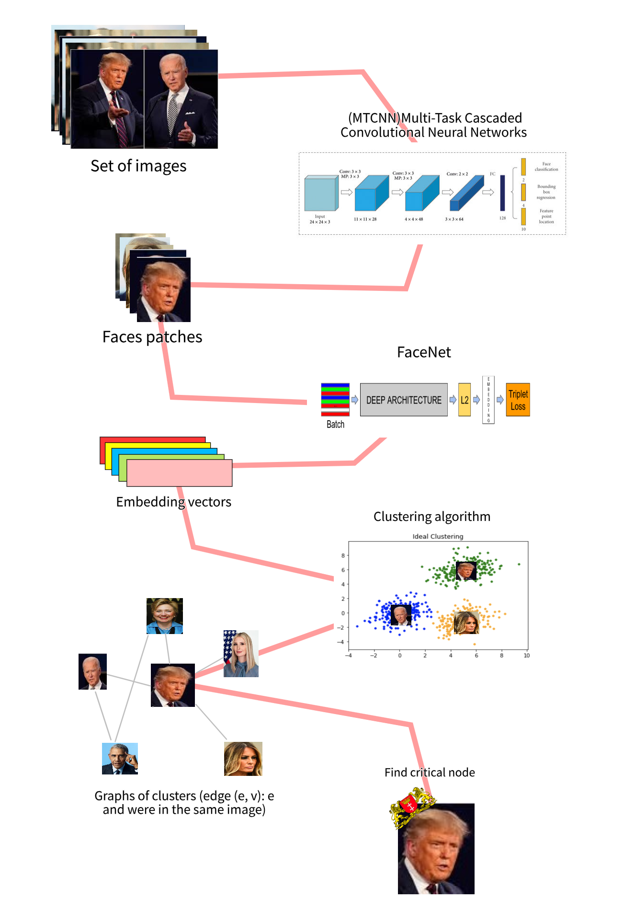

# Image2Owner
Given a set of photos from a certain media account without a profile picture, write an algorithm that identifies the owner of the account.
## Notebooks
There are two notebooks:
- [DataSet notebook](DataSet.ipynb): The first notebook that make the embeddings vectors from the images dataset
- [Cluster notebook](Cluster,ipynb): The second notebook that find the owner of the acount based on the embedding results from the [previous notebook](DataSet.ipynb).
  ## Algorithm

>Algorithm pipe line visualization
## Self-use
If you wanna use it yourself make sure you save your images in folder called data and make sure you have the necessary libraries as they appear in the imports section at the beginning of each notebook (I personally used Python 3.7 but any recent enough version should work).
